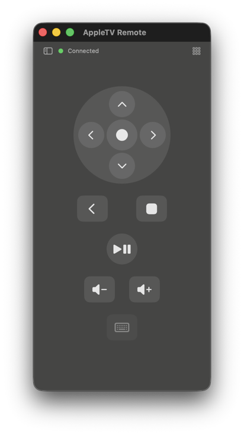
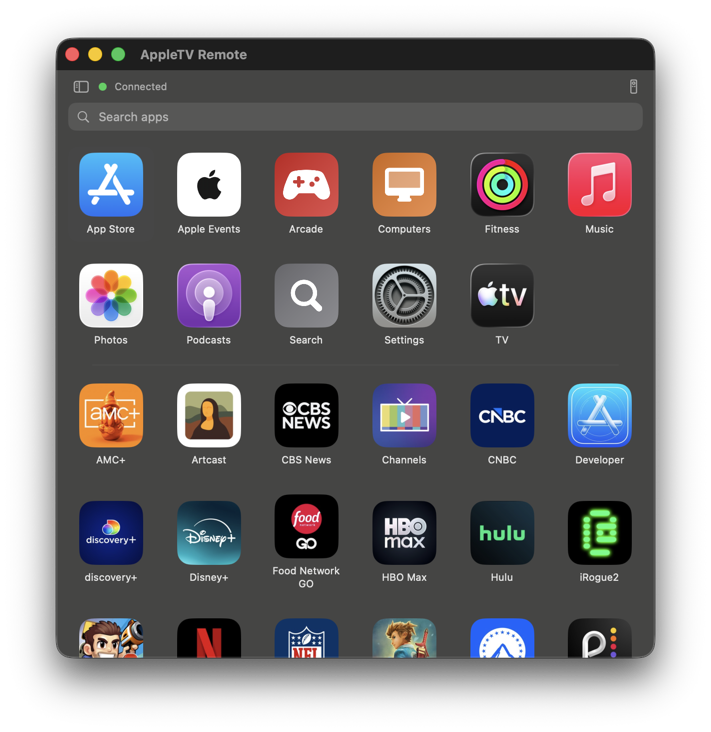

# Apple TV Remote

A macOS app that discovers and controls Apple TVs on the local network via the **Companion** and **Media Remote Protocol (MRP)** protocols. Includes a full-featured main window with device sidebar and remote control UI, and a scriptable `atv` CLI companion tool.

## Features

- **Menu bar app** — lives in the menu bar; popover remote for quick access
- **Main window** — collapsible device sidebar + remote control pane with D-pad, playback, volume, now-playing
- **App launcher** — browse and launch apps installed on the Apple TV
- **Keyboard text input** — type into active Apple TV text fields from the Mac
- **`atv` CLI** — scriptable control from the terminal or shell scripts
- **Auto-reconnect** — reconnects automatically when the Apple TV becomes reachable
- **Keyboard shortcuts** — `A` to open app grid, `R` to return to remote, arrow keys to navigate apps

## Screenshots

| Remote (`remote.png`) | Remote + sidebar (`remote with sidebar.png`) |
|--------|-----------------|
|  |  |

| App grid (`appgrid.png`) | App grid + sidebar (`appgrid with sidebar.png`) |
|----------|--------------------|
|  |  |

## Install

Grab the latest signed + notarized DMG from the
**[Releases page](https://github.com/alokdhir/appletv-remote/releases/latest)**.

1. Download `AppleTVRemote-X.Y.Z.dmg`.
2. Open it — Gatekeeper accepts it directly (no "unidentified developer" warning) since it's notarized by Apple.
3. Drag `AppleTVRemote.app` onto the `Applications` shortcut.
4. *(Optional)* For the `atv` CLI: open a Terminal in the mounted DMG and run `./install.sh` — copies the app to `/Applications` and the CLI to `/usr/local/bin/atv` in one go.
5. Launch from `/Applications` (or run `atv help` from the terminal).

That's it — no Xcode, no command-line build required.

## Requirements

- macOS 13+
- Apple TV on the same local network
- Xcode 26 / Swift 6 *(only if you want to build from source)*

### Optional dependencies

- **[terminal-notifier](https://github.com/julienXX/terminal-notifier)** — improves keyboard-input notifications. Without it the app falls back to `osascript display notification`, which appears attributed to "Script Editor" and opens Script Editor when clicked. With terminal-notifier, notifications show the AppleTVRemote icon and clicking focuses the app.

  ```bash
  brew install terminal-notifier
  ```

  > **Note:** The first time a notification fires, macOS will open System Settings → Notifications and ask you to explicitly allow terminal-notifier to send notifications. Do that once and notifications will work from then on.

## Building from source

If you'd rather build it yourself than use the prebuilt DMG above.

### Swift (recommended — builds everything)

```bash
# Debug build (fast, for development)
swift build

# Release build (optimised, for daily use)
swift build -c release

# Run tests
swift test
```

Builds the GUI app, the `atv` CLI, all modules, and tests.

### Xcode

```bash
xcodebuild -project AppleTVRemote.xcodeproj -scheme AppleTVRemote -configuration Release
```

Builds only the `AppleTVRemote.app` GUI target. Use this path for archiving, signing, and notarizing for distribution.

### Installing after a release build

```bash
cp -f .build/release/AppleTVRemote /Applications/AppleTVRemote.app/Contents/MacOS/AppleTVRemote
cp -rf .build/release/AppleTVRemote_AppleTVRemote.bundle /Applications/AppleTVRemote.app/Contents/Resources/
cp -f .build/release/atv /usr/local/bin/atv
codesign --force --deep --sign - /Applications/AppleTVRemote.app
```

> **Note:** Always copy both the binary *and* the `.bundle` — the bundle contains
> bundled app icons and other resources that SwiftUI's `Bundle.module` reads at runtime.

## Pairing

Launch the app, select your Apple TV from the sidebar, and click **Connect**. The Apple TV will display a 4-digit PIN — enter it in the pairing dialog. Credentials are saved automatically.

```bash
# Or pair from the CLI
atv pair "Living Room"
```

## `atv` CLI Reference

```bash
# Discovery & setup
atv list               # list discovered Apple TVs
atv status             # connection state + now-playing
atv pair <name>        # pair with an Apple TV (prompts for PIN)
atv select <name>      # set default device for subsequent commands

# Navigation
atv u / d / l / r      # D-pad up / down / left / right
atv click              # D-pad centre (select)
atv menu               # menu / back
atv home               # home button
atv sl / sr / su / sd  # trackpad swipe left/right/up/down

# Playback & volume
atv pp                 # play/pause
atv vol+ / vol-        # volume up/down
atv power              # wake if asleep, sleep if on

# App launcher
atv apps               # list installed apps
atv launch <bundleID>  # launch an app by bundle ID

# Chaining
atv 3 r                # repeat right × 3
atv r u d              # right, then up, then down

# Standalone mode (no app required — connects directly)
atv --standalone apps
atv --standalone --device "Living Room" l
```

## Keyboard Controls

### Remote control pane

| Key | Action |
|-----|--------|
| `↑ ↓ ← →` | D-pad up / down / left / right |
| `Return` | Select (D-pad centre) |
| `M` | Menu / Back |
| `H` | Home |
| `Space` or `P` | Play / Pause |
| `A` | Open app launcher |
| `⌫ Backspace` | Delete last character _(when Apple TV text field is active)_ |

### App launcher pane

| Key | Action |
|-----|--------|
| `↑ ↓ ← →` | Navigate app grid |
| `Return` | Launch selected app |
| `Tab` | Focus search field |
| `R` | Return to remote |

## Credential Storage

Pairing credentials (Ed25519 long-term key pair + Apple TV public key) are stored as JSON in:

```
~/Library/Application Support/AppleTVRemote/<device-id>.json         # Companion
~/Library/Application Support/AppleTVRemote/<device-id>.airplay.json # AirPlay
```

**Security note:** The Ed25519 private key (`ltsk`) is stored in plaintext.

## Architecture

| File | Role |
|------|------|
| `AppleTVRemoteApp.swift` | `@main` entry point; owns `DeviceDiscovery`, `AutoReconnector` |
| `AppleTVDevice.swift` | Device model, `ConnectionState`, `RemoteCommand` enums |
| `DeviceDiscovery.swift` | Bonjour browser (`_companion-link._tcp`) using `NWBrowser` |
| `ContentView.swift` | Root split layout (collapsible sidebar + detail) |
| `DeviceListView.swift` | Sidebar: device list, auto-connect toggles |
| `RemoteControlView.swift` | D-pad, playback, volume, now-playing card, app launcher toggle |
| `AppLauncherView.swift` | App grid with search, keyboard navigation, responsive columns |
| `MenuBarController.swift` | Menu bar status item, popover, right-click menu |
| `AppIconCache.swift` | Fetches and caches app icons from iTunes + bundled system icons |
| `Protocol/CompanionConnection.swift` | TCP Companion session: pair-setup, pair-verify, encrypted OPACK |
| `Protocol/OPACK.swift` | OPACK binary encoder/decoder |
| `Protocol/CredentialStore.swift` | JSON credential persistence |
| `AppleTVIPC/IPCProtocol.swift` | IPC protocol between app and `atv` CLI |

### Protocol overview

- Apple TVs advertise `_companion-link._tcp` via Bonjour; port is resolved dynamically
- Pairing: SRP-6a (HAP-style) + Ed25519 long-term keys, OPACK-framed
- Session: ChaCha20-Poly1305 encrypted OPACK frames over raw TCP
- App launcher: `FetchLaunchableApplicationsEvent` over the established Companion session
- AirPlay MRP tunnel: encrypted RTSP → DataStream → MRP protobuf for now-playing metadata

## Acknowledgements

This project would not have been possible without **[pyatv](https://github.com/postlund/pyatv)** by [Pierre Ståhl](https://github.com/postlund) and contributors.

pyatv is an open-source Python library that reverse-engineered and documented Apple's proprietary Apple TV protocols — including the Companion protocol, OPACK binary format, HAP-style pairing, and the AirPlay MRP tunnel. It served as the primary protocol reference throughout the development of this project.

Many thanks to the pyatv project and contributors for their work documenting undocumented protocols and making that knowledge freely available.

> pyatv is licensed under the MIT License.
> https://github.com/postlund/pyatv
